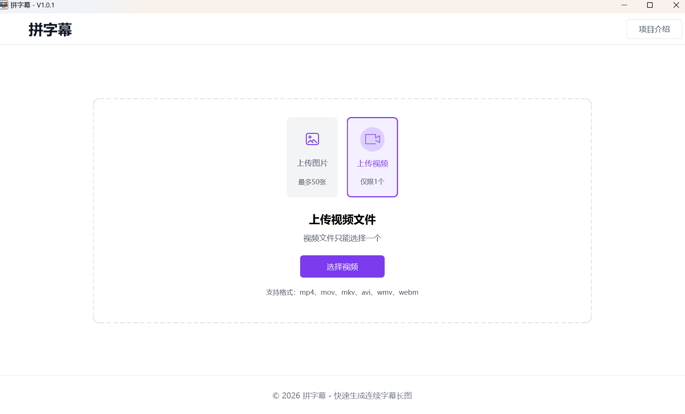
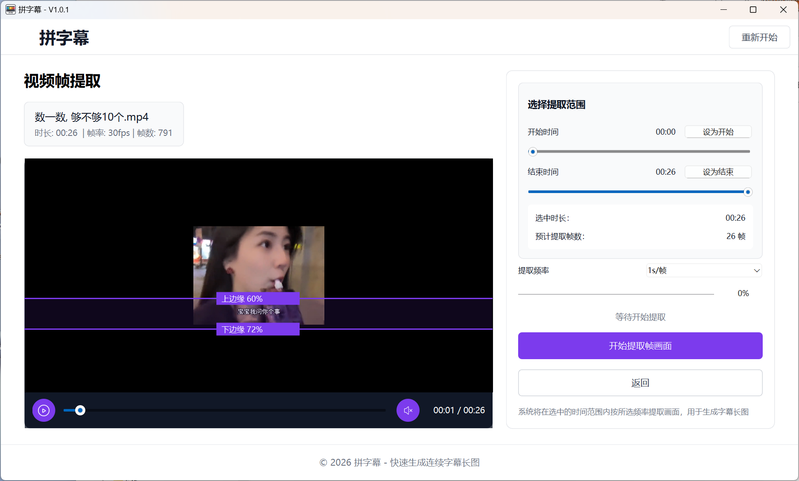
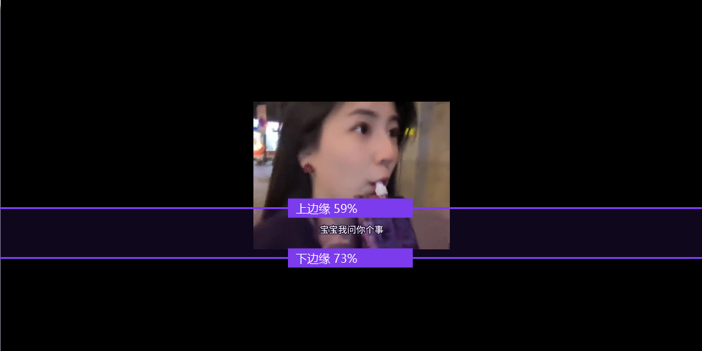
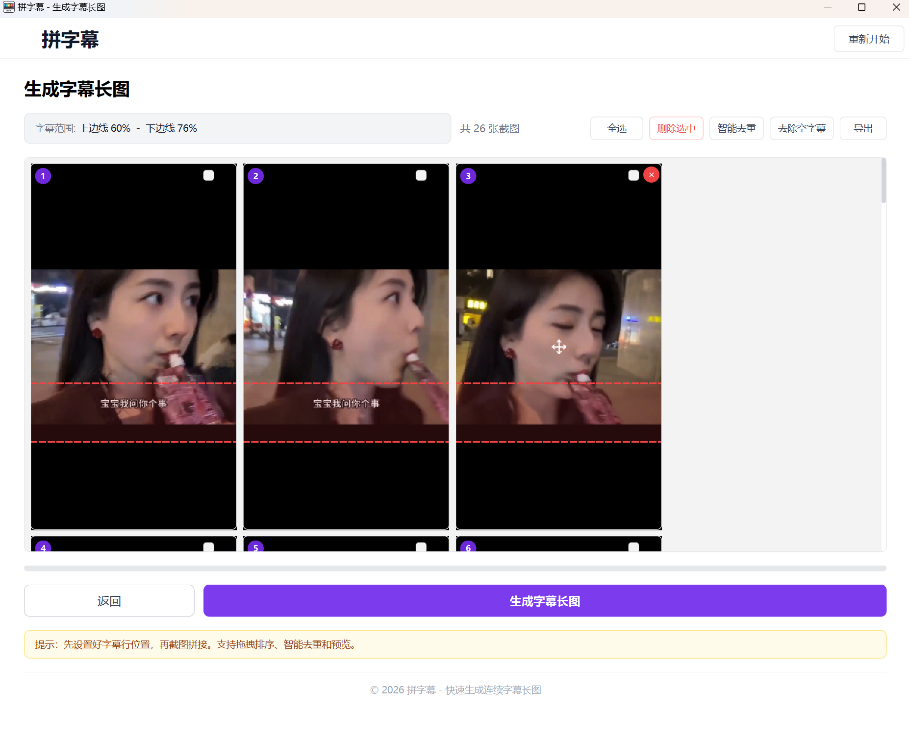
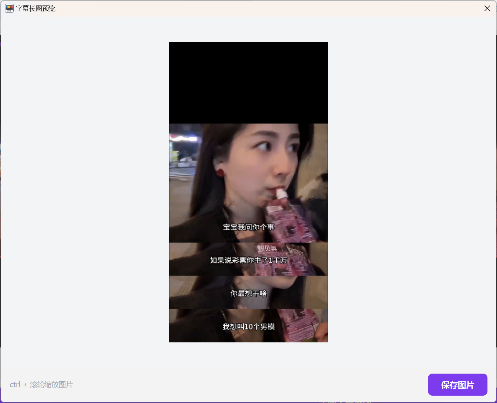
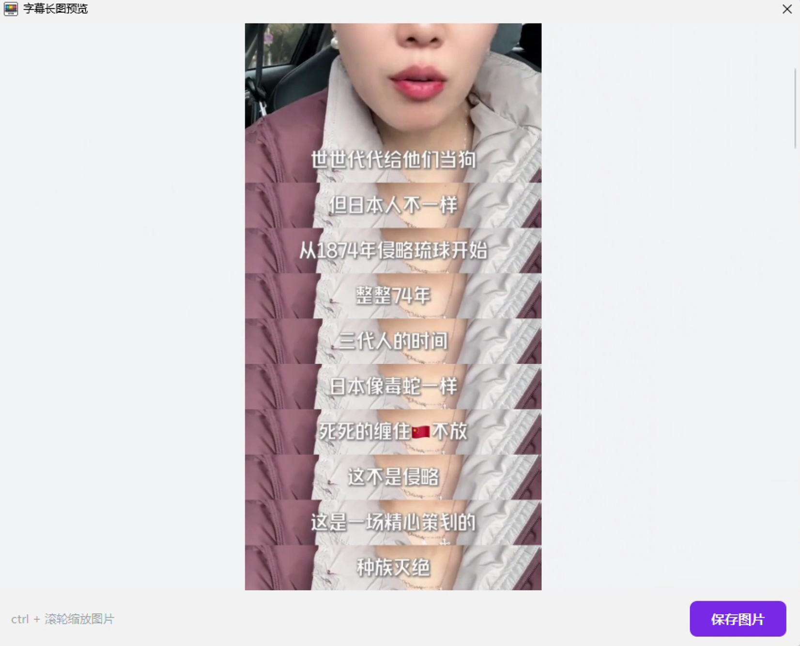
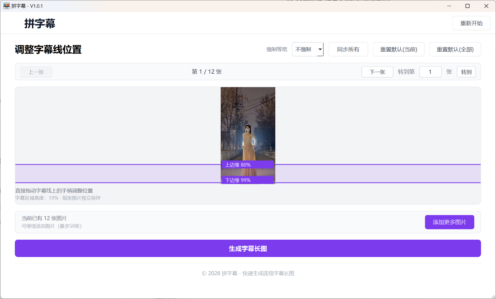

# 拼字幕

一款**离线运行**的桌面工具，支持从**图片**或**视频**中提取字幕画面，智能去重后快速拼接成连续字幕长图，适用于影视台词整理、课程字幕摘录、短视频内容复盘和社交媒体分享等场景。

## 核心功能

### 1. 图片 & 视频双模式

| 图片模式 | 视频模式 |
|---|---|
| 支持 JPG、PNG、GIF、WEBP 格式 | 支持 MP4、MOV、MKV、AVI、WMV、WEBM 格式 |
| 一次选择多张图片（最多 50 张） | 上传单个视频文件 |
| 按选择的顺序拼接 | 自定义时间范围，选择提取频率 |
| 可在调整步骤中追加图片 | 自动将视频帧转为画面用于拼接 |

### 2. 完全离线运行

- 不需要联网，所有处理本地完成
- 无文件上传、无隐私风险
- 双击启动，即开即用

### 3. 智能去重

- 感知哈希算法自动检测相似画面
- 去除重复或高度相似的帧/图片
- 支持手动选择保留或删除
- 避免字幕长图中出现冗余画面

### 4. 可视化字幕区域调整

- 上、下两条拖拽线精确框定字幕范围
- 实时预览裁剪效果
- 位置自动保存，下次打开仍有效
- 支持重置为默认值

### 5. 图片网格管理

- 拖拽排序：自由调整画面顺序
- 批量勾选 + 一键删除
- 序号角标自动重排
- 图片缩略图预览

### 6. 长图生成与导出

- 按字幕区域统一裁剪、对齐
- 纵向拼接为一张长图
- 结果弹窗预览+缩放浏览
- 一键保存到本地（PNG 格式）

## 使用流程

```
选择素材 → 调整字幕区域 → 管理图片列表 → 生成字幕长图 → 保存导出
```

1. **选择素材** — 根据需求选择图片模式或视频模式，上传文件
2. **视频提取帧**（仅视频模式）— 设置时间范围和提取频率，提取视频关键帧
3. **调整字幕区域** — 拖动上、下两条边界线，框定字幕所在范围
4. **管理图片列表** — 排序、删减、去重，确认最终画面
5. **生成字幕长图** — 一键拼接，预览效果
6. **保存导出** — 将长图保存到本地

## 界面截图

主界面 - 选择图片或视频模式

视频帧提取 - 设置时间范围

字幕线调整 - 拖动边界线

图片管理 - 排序/删除/去重

长图结果 - 预览与导出

长图结果 - 预览与导出

图片拼接 - 字幕线调整, 仅示例



## 适用场景

- **影视台词整理** — 把经典台词画面拼成长图收藏
- **课程字幕摘录** — 将视频课程重点画面导出为笔记长图
- **短视频内容复盘** — 快速截取关键帧，生成内容概要长图
- **剧情回顾长图** — 一部剧、一集内容的精彩画面回顾
- **社交媒体分享** — 生成规整美观的字幕长图直接分享

## 其他说明

- 桌面应用，双击 `PZM.exe` 即可启动
- 图片拼接前会进行尺寸对齐，保证输出长图规整统一
- 视频帧提取支持按时间间隔（0.5s / 1s / 2s / 3s / 全部帧）灵活选择
- 字幕线位置偏好自动记忆，下次打开无需重复设置
